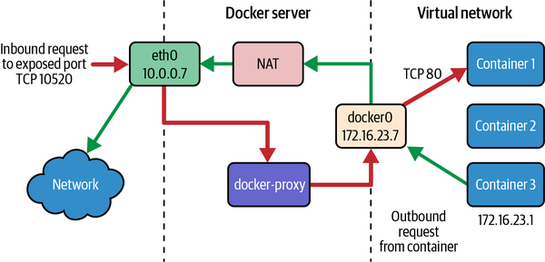

## Docker Networking


Docker networking enables containers to communicate with each other, with the Docker host, and with external networks. It abstracts and manages container-to-container and container-to-host networking using virtual interfaces, bridges, and routing rules. Here's a breakdown of how Docker networking works:

Docker provides several built-in network drivers:


1. Bridge (default)
**Used for:** Standalone containers on a single host.
**Behavior:** Docker creates a virtual bridge (usually docker0) and connects containers to it via virtual Ethernet interfaces.
**IP Allocation:** Each container gets an IP on the bridge subnet.
Communication: Containers on the same bridge can communicate using IP or container name.

```shell
docker container run -d -p 8080:8080 -h node-demo-h1 --name node-demo-c1 node-demo

docker container run -d -p 8081:8080 -h node-demo-h2 --name node-demo-c2 node-demo

```

On the host : 

```text
$ ip addr show

1: lo: <LOOPBACK,UP,LOWER_UP> mtu 65536 qdisc noqueue state UNKNOWN group default qlen 1000
    link/loopback 00:00:00:00:00:00 brd 00:00:00:00:00:00
    inet 127.0.0.1/8 scope host lo
       valid_lft forever preferred_lft forever
    inet6 ::1/128 scope host noprefixroute 
       valid_lft forever preferred_lft forever
       
2: ens33: <BROADCAST,MULTICAST,UP,LOWER_UP> mtu 1500 qdisc mq state UP group default qlen 1000
    link/ether 00:50:56:b9:c5:16 brd ff:ff:ff:ff:ff:ff
    altname enp2s1
    inet 10.10.1.22/24 brd 10.10.1.255 scope global dynamic noprefixroute ens33
       valid_lft 63340sec preferred_lft 63340sec
    inet6 fe80::250:56ff:feb9:c516/64 scope link 
       valid_lft forever preferred_lft forever
       
3: virbr0: <NO-CARRIER,BROADCAST,MULTICAST,UP> mtu 1500 qdisc noqueue state DOWN group default qlen 1000
    link/ether 52:54:00:c2:c1:57 brd ff:ff:ff:ff:ff:ff
    inet 192.168.122.1/24 brd 192.168.122.255 scope global virbr0
       valid_lft forever preferred_lft forever
       
4: docker0: <BROADCAST,MULTICAST,UP,LOWER_UP> mtu 1500 qdisc noqueue state UP group default 
    link/ether aa:92:fc:0a:4b:93 brd ff:ff:ff:ff:ff:ff
    inet 172.17.0.1/16 brd 172.17.255.255 scope global docker0
       valid_lft forever preferred_lft forever
    inet6 fe80::a892:fcff:fe0a:4b93/64 scope link 
       valid_lft forever preferred_lft forever
       
47: vethe999413@if2: <BROADCAST,MULTICAST,UP,LOWER_UP> mtu 1500 qdisc noqueue master docker0 state UP group default 
    link/ether d2:c3:88:db:5e:7e brd ff:ff:ff:ff:ff:ff link-netnsid 0
    inet6 fe80::d0c3:88ff:fedb:5e7e/64 scope link 
       valid_lft forever preferred_lft forever
48: veth8ff261a@if2: <BROADCAST,MULTICAST,UP,LOWER_UP> mtu 1500 qdisc noqueue master docker0 state UP group default 
    link/ether 22:57:72:40:c4:1e brd ff:ff:ff:ff:ff:ff link-netnsid 1
    inet6 fe80::f060:e3ff:feb3:70ed/64 scope link 
       valid_lft forever preferred_lft forever
```

```text
$ brctl show docker0

bridge name     bridge id               STP enabled     interfaces
docker0         8000.aa92fc0a4b93       no              veth8ff261a


$ bridge link show
47: vethe999413@ens33: <BROADCAST,MULTICAST,UP,LOWER_UP> mtu 1500 master docker0 state forwarding priority 32 cost 2 
48: veth8ff261a@ens33: <BROADCAST,MULTICAST,UP,LOWER_UP> mtu 1500 master docker0 state forwarding priority 32 cost 2                                                         vethe999413
```




enter 


2. Host
**Used for:** High-performance use-cases on Linux only.
**Behavior:** The container shares the host’s network stack (no isolation).
**IP Allocation:** The container uses the host’s IP address.