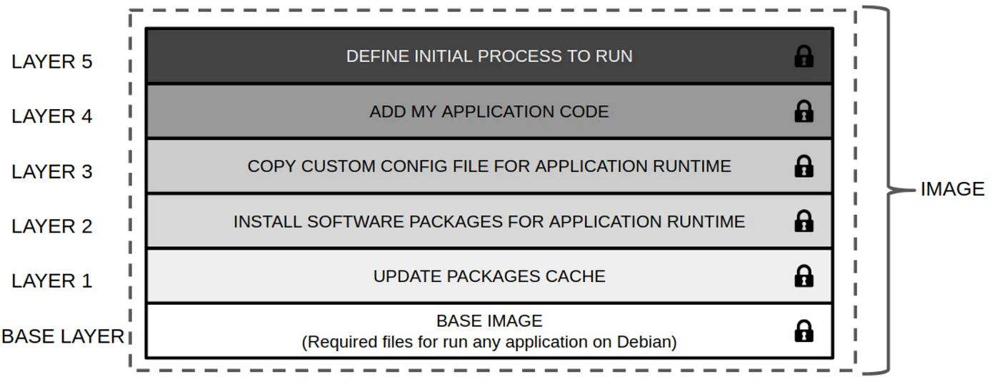

# Building a Docker Image

## Dockerfile 
A Dockerfile describes the steps required to create an image. This is contained
Within the root directory of the source code repository for your application.

Each line in the Dockerfile represents a layer in the resultant image.


### Example:
Below is an example Dockerfile to containerize a demo Node.js application.

```dockerfile
FROM docker.io/node:lts
LABEL authors="prabhat"
LABEL app='ContainerInfo'

ARG email="prabhat3107@gmail.com"

ENV AP="/data/app"

COPY siglestage/node-demo-app/app $AP

WORKDIR $AP

RUN sudo apt install curl
RUN npm init -y
RUN npm install express

EXPOSE 8080

CMD ["node", "server.js"]
```


Explanation : 

You create your image based on a standard NodeJS image available from the docker registry

```dockerfile
FROM docker.io/node:lts
```
Label are key/value pair of metadata that can be added to the image. These metadata can late be
used to search for and identify the image and containers. 
```dockerfile
LABEL authors="prabhat"
```
ARG provides a way to set variables and their default values, which are only available during the image build process.
```dockerfile
ARG email="prabhat3107@gmail.com"
```
ENV allows to set shell variables that be used by running application for configuration, in addition to being available during the build process.
```dockerfile
ENV AP="/data/app"
```
COPY instruction is used to copy files from the local filesystem into the image 
It is no longer needed to access to the local filesystem to access them once the image is built.

```dockerfile
COPY siglestage/node-demo-app/app $AP
```
WORKDIR allows to change the working directory in the image for the remainning build instructions and the default 
process that launches with any resulting containers. 
```dockerfile
WORKDIR $AP
```
RUN instructions/commands executes the commands in a new layer and commits the resutls 
This allows to install dependent packages/libraries in the image. 
```dockerfile
RUN npm init -y
RUN npm install express
```
The EXPOSE instruction in a Dockerfile declares the ports a container will listen on at runtime.
```dockerfile
EXPOSE 8080
```
The CMD instruction in a Dockerfile specifies the default command to execute when a container starts from the image.
```dockerfile
CMD ["node", "server.js"]
```

### Dockerfile Reference
#### Official reference page
https://docs.docker.com/reference/dockerfile/
#### From Internet 
https://kapeli.com/cheat_sheets/Dockerfile.docset/Contents/Resources/Documents/index