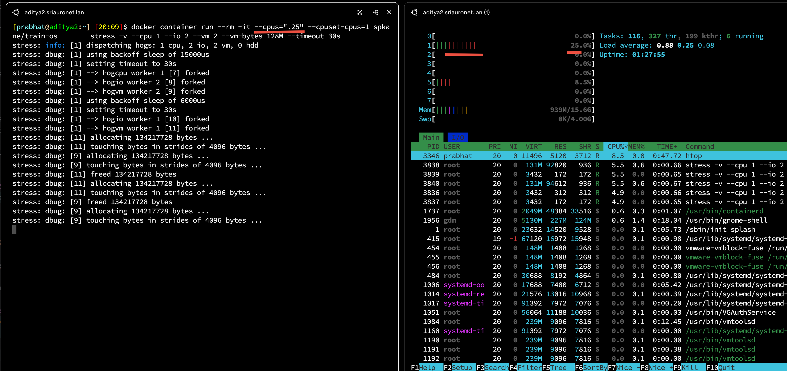
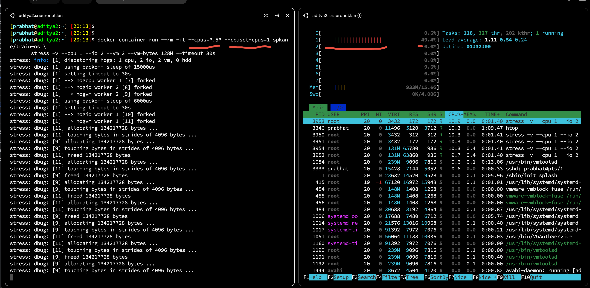

## Resource Quotas 

Containers leverage cgroup functionality in the Linux kernel to control the resoruces that are available to a linux contqiner. 
The docker container create and docker container run commands directly support CPU, memory, swap and storage I/O restrcitions
when you create a container. 

### CPU quotas 

This is the newer and  greatly simplified way of setting CPU quota to the container. 
YOu can tell how much CPU you would like to be available to your container and docker will do 
the math required to set the uderlying cgroups correctly. 

this is done with **--cpus** option. This can be set to a floating point numb er between 0.01 and the number of CPU cores
on the host Docker server. 

We'll be using the stress command running from within a container from a custom build image : spkane/train-os . 


```text
stress --cpu 1 --io 2 --vm 2 --vm-bytes 128M --timeout 30s
```


#### CPU core binding

This done with **--cpuset-cpus** option. it takes the cpu cores number ( starting with 0)

Example :  

```shell
docker container run --rm -it --cpus=".25" --cpuset-cpus=1 spkane/train-os \
       stress -v --cpu 1 --io 2 --vm 2 --vm-bytes 128M --timeout 30s 
```

output : 



```shell
docker container run --rm -it --cpus=".5" --cpuset-cpus=1 spkane/train-os \
       stress -v --cpu 1 --io 2 --vm 2 --vm-bytes 128M --timeout 30s 
```

