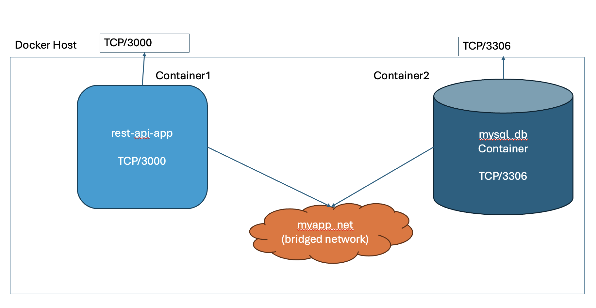

# EXAMPLE REST API app 

## prabhat3107/KubernetesTrainingForMDS
This app demonstrates RESTful API using Node.js, the Express.js framework, and a MySQL database.



### URI mapping 
```text
GET /programming-languages → getMultiple()
POST /programming-languages → create()
PUT /programming-languages/:id → update()
DELETE /programming-languages/:id → remove()
```

### GET
#### prints all the records in the DB table 
```shell

curl http://localhost:3000/programming-languages
```

### POST 
#### creates new record in the DB table
```shell
curl -i -X POST -H 'Accept: application/json' \
    -H 'Content-type: application/json' http://localhost:3000/programming-languages \
    --data '{"name":"dart", "released_year": 2011, "githut_rank": 13, "pypl_rank": 20, "tiobe_rank": 25}'
```

### PUT
#### updates a record 
```shell
curl -i -X PUT -H 'Accept: application/json' \
    -H 'Content-type: application/json' http://localhost:3000/programming-languages/17 \
    --data '{"name":"dart", "released_year": 2011, "githut_rank": 12, "pypl_rank": 20, "tiobe_rank": 25}'
```

### DELETE 
#### removes a record from the DB table
```shell
curl -i -X DELETE -H 'Accept: application/json' \
    -H 'Content-type: application/json' http://localhost:3000/programming-languages/17
```
### Search a record  /programming-languages/:id

```shell
curl http://localhost:3000/programming-languages/16
```

Reference : 
https://blog.logrocket.com/build-rest-api-node-express-mysql/